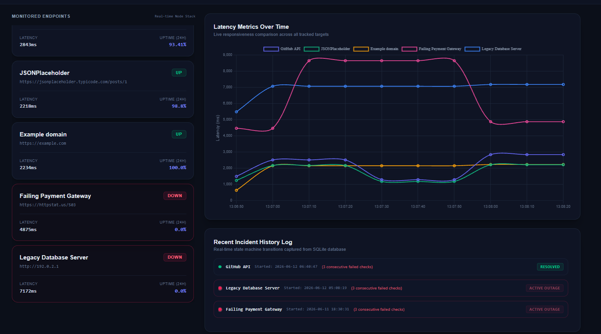
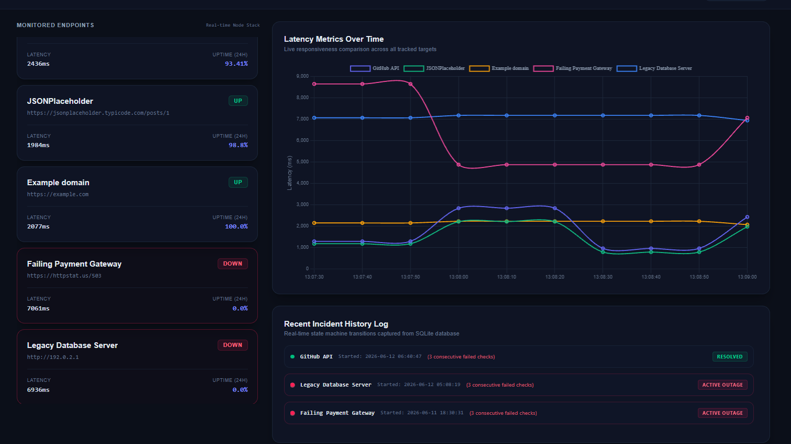

# API Health Monitor — Executive Console

A lightweight, self-hosted monitoring tool that tracks the health and performance of websites, APIs, and internal services in real time.

Think of it as a personal version of **UptimeRobot** or **Datadog** that runs entirely on your own machine without requiring cloud accounts or external services.

Built with **Python**, **FastAPI**, **SQLite**, **APScheduler**, **Tailwind CSS**, and **Chart.js**.

---

## Features

### Real-Time Monitoring
- Continuously monitors configured websites and APIs.
- Measures response times and availability.
- Supports multiple endpoints running on independent schedules.

### Thread-Pool Concurrency
- Runs health checks on independent schedules via APScheduler's background thread pool.
- Ensures a slow or hanging check on one endpoint never blocks or delays checks on other targets.

### Incident Detection & Tracking
- Detects repeated failures using configurable thresholds.
- Automatically creates outage records when a service goes down.
- Automatically marks incidents as resolved when the service recovers.

### Executive Dashboard
- Modern dark-themed monitoring console.
- Split-screen layout inspired by Network Operations Center (NOC) dashboards.
- Live latency charts and uptime analytics.
- Structured layout designed to minimize scrolling for common monitoring tasks.

### Local Storage
- Uses SQLite for storing:
  - Monitoring history
  - Latency metrics
  - Incident records
  - Uptime statistics

---

## Tech Stack

- Python 3.10+
- FastAPI
- SQLite
- APScheduler
- HTTPX
- Tailwind CSS
- Chart.js

---

## Project Structure

```text
api-health-monitor/
├── monitors.json       # Monitoring configuration
├── requirements.txt    # Project dependencies
├── main.py             # Application entry point
│
├── app/
│   ├── db.py           # Database connection handling
│   ├── checker.py      # Health check execution logic
│   ├── incidents.py    # Incident state management
│   ├── alerts.py       # Alert dispatch layer
│   ├── stats.py        # Analytics and uptime calculations
│   ├── scheduler.py    # Background monitoring scheduler
│   ├── cli.py          # Terminal-based monitoring view
│   └── api.py          # FastAPI routes and APIs
│
└── templates/
    └── status.html     # Dashboard UI
```

---

## Requirements

Before running the project, make sure you have:

- Python 3.10 or newer
- pip

---

## Installation

### 1. Clone the Repository

```bash
git clone git@github.com:glennPerez1/Lightweight-API-Reliability-Incident-Monitoring-Platform.git 

git clone https://github.com/glennPerez1/Lightweight-API-Reliability-Incident-Monitoring-Platform.git 

cd api-health-monitor
```

### 2. Create a Virtual Environment

```bash
python -m venv venv
```

### 3. Activate the Virtual Environment

#### Windows (Git Bash)

```bash
source venv/Scripts/activate
```

#### Windows (CMD)

```cmd
venv\Scripts\activate.bat
```

#### macOS / Linux

```bash
source venv/bin/activate
```

You should now see `(venv)` at the beginning of your terminal prompt.

### 4. Install Dependencies

```bash
pip install -r requirements.txt
```

---

## Configuration

Edit the `monitors.json` file to add the services you want to monitor.

Example:

```json
{
  "monitors": [
    {
      "name": "GitHub API",
      "url": "https://api.github.com",
      "interval_sec": 30,
      "timeout_sec": 5,
      "fail_threshold": 3
    },
    {
      "name": "Legacy Database Server",
      "url": "http://192.0.2.1"
    }
  ]
}
```

### Configuration Options

| Field | Description |
|---------|------------|
| name | Display name of the monitored service |
| url | Target endpoint URL |
| interval_sec | Time between health checks |
| timeout_sec | Request timeout |
| fail_threshold | Number of consecutive failures before creating an incident |

If optional values are omitted, safe default values are used automatically.

---

## Running the Application

Start the monitoring service:

```bash
python main.py
```

## Using the project

While `main.py` is running, open your browser and navigate here first to explore the system:

| URL | Component | What it shows |
|---|---|---|
| **`http://localhost:8000/page`** | **Executive Management Console** | **Main Visual Dashboard (Green/Red node cards, live latency charts, persistent logs)** |
| `http://localhost:8000/docs` | Swagger UI Docs | Interactive API docs — test and run every backend endpoint directly |
| `http://localhost:8000/status` | Raw Telemetry Stream | Live JSON payload output tracking the status of all monitors |
| `http://localhost:8000/incidents` | Core Incident Registry | Raw JSON data array of all past and active outages |

---
## Dashboard Walkthrough

### Dashboard Screenshots

#### Checkpoint 1: The Matrix Baseline (13:08:20)



This screenshot captures the monitoring system during a steady-state polling cycle while multiple incidents are already active.

* **High-Latency Recovery Event:** The Failing Payment Gateway (pink line) has just recovered from a severe latency spike of nearly 9,000 ms and dropped back to approximately 4,875 ms. Despite the latency improvement, the endpoint is still returning a 503 Service Unavailable response, so the service remains marked as DOWN and its uptime remains at 0.0%.
* **Permanent Blackhole Endpoint:** The Legacy Database Server (blue line) remains completely flat at approximately 7,172 ms. This endpoint uses the reserved IP address 192.0.2.1, which intentionally cannot respond. Every monitoring cycle therefore reaches the configured network timeout limit, producing a consistent latency ceiling.
* **Persistent Incident Logging:** The incident history panel demonstrates the system's state-machine-based outage tracking: One previously resolved GitHub API outage and two currently active outage records. Incident data remains persisted inside SQLite for historical analysis.

---

#### Checkpoint 2: The Next Poll Cycle (13:09:00)



This screenshot was captured during the next scheduled polling cycle approximately 40 seconds later.

* **Multi-Service Latency Cross:** A new monitoring cycle has completed and the Failing Payment Gateway (pink line) spikes again to approximately 7,061 ms, crossing over the Legacy Database Server latency line on the chart.
* **Dynamic Chart Updates:** The dashboard updates in real time. Older metrics automatically shift left, the oldest timestamp exits the graph window, and newly collected metrics appear on the right edge. Chart.js redraws the visualization smoothly without requiring a page refresh.
* **Duplicate Incident Prevention:** Although both failing services generated additional failed checks, the incident log remained unchanged. This behavior demonstrates the outage state machine: The backend checks whether an incident already exists, existing active outages are identified, and duplicate incident records are prevented. Only genuine state transitions (DOWN → UP or UP → DOWN) generate new database entries, keeping the incident history clean.
---

## Future Improvements

- Email alerts
- Slack notifications
- Discord webhooks
- Multi-user authentication
- Docker deployment support
- PostgreSQL support
- Historical reporting and exports